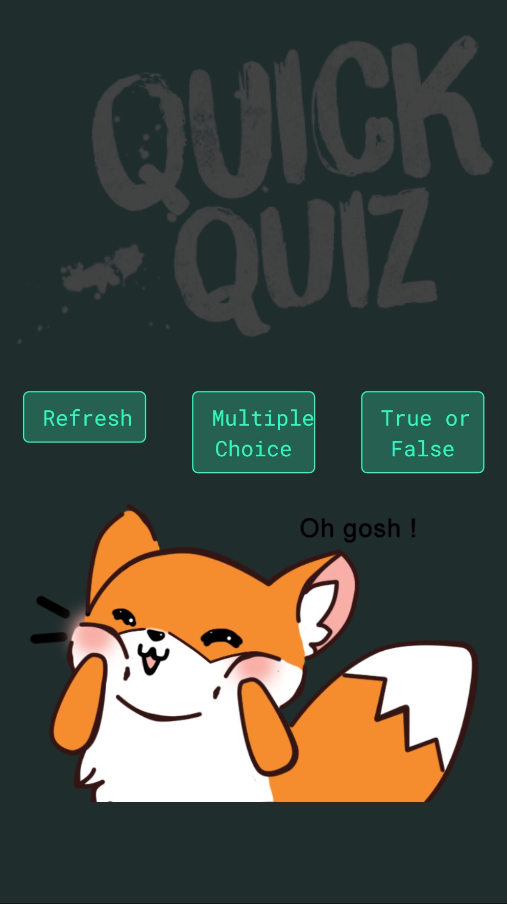

# Trivia

¿Aburrido? ¿Muchas paginas para responder trivias y ninguna con la tematica que te gusta?, para ello viene Quiza-trivia, una pagina donde podras relaizar trivias con respuestas multiples o verdadero o falso, sobre videojuegos version movil.

# Enunciado problematica propuesta

Se nos pidio crear una wep-app que nos permitiera mostarrle al usuario una serie de preguntas para responder sacas a apartir de una api!

## Esto podemos lograrlo con el API de Open Trivia DB.

* Tú escoges el diseño
* Debe ser mobile first
* Debes subir tu proyecto a Github Pages
* Usar framework de CSS a tú elección

## Recursos

* API de Open Trivia DB

## Desarrollado para
[Laboratoria](http://www.laboratoria.la/)